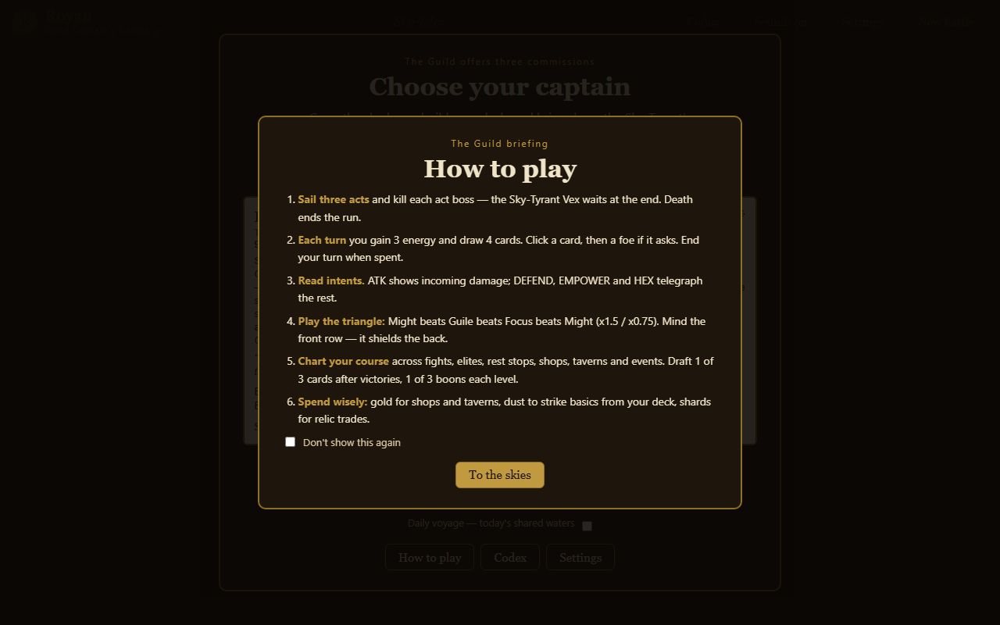
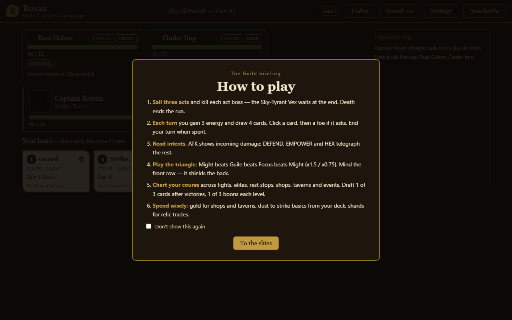

# Royan RPG Card Game

A roguelike deckbuilder about a sky-isles mercenary Guild Captain. Draft a
war-band, build a deck, cross a 3-act branching map, and kill the Sky-Tyrant's
captains — three two-phase bosses with aspect-shifting second forms.




- 3 heroes (Knight / Ranger / Runemage), 90 cards, 12 enemies, 20 relics, 32 events, 5 companions
- Lane combat with front/back rows, telegraphed intents, and an aspect triangle
- Full RPG layer: XP levels 1–10, boons, gold/dust/shards economy, shops, taverns, shrines
- Daily voyage (one shared seed per day), tiered quick skirmishes, guided first run

## Play in 30 seconds — no installs

1. Download **RoyanRPG-win.zip** from the
   [v3.0 release](https://github.com/Chris0Jeky/Royan-RPG-CARD-GAME/releases/tag/v3.0).
2. Unzip it anywhere and double-click **RoyanRPG.exe**.
3. Your browser opens with music playing and your captain awaiting orders.

No JDK, no Maven, no Node, no port-picking: the bundle carries its own Java
runtime, finds a free port, and opens the game for you. The game is fully
offline — nothing ever leaves your machine.

## One-command dev quickstart

```sh
./play.sh            # Windows: play.bat — builds if stale, serves, opens the browser
```

Requires JDK 17 + Maven 3.9 once (portable install:
[ORCHESTRATION.md](ORCHESTRATION.md#toolchain-portable-outside-repo--onedrive-safe)).
This is THE way to run from source. Other modes:

```sh
mvn test                                   # full gate: 137 tests, must be green
./play.sh                                  # ...then in the browser: campaign, skirmish, daily
```

Terminal instead of browser (from `mvn -q compile`, run `java -cp`
per [AGENTS.md](AGENTS.md)): `play [CLASS] [seed]`, `continue`, `auto [seed]
[CLASS]`, `serve [port]` (port `0` = free port, browser auto-opens).

Release engineering: `python tools/qa/release.py` runs every gate (suite,
artifact smoke, browser QA, full-campaign playtest bot) and stamps readiness.
CI runs the suite + artifact smoke on every push.

## Docs

- [docs/RULES.md](docs/RULES.md) — how to play (players start here)
- [docs/DESIGN.md](docs/DESIGN.md) — locked rules authority + balance log
- [docs/QA.md](docs/QA.md) — test gates, balance oracle, release checklist
- [docs/DEVLOG.md](docs/DEVLOG.md) — milestone journal
- [CHANGELOG.md](CHANGELOG.md) — per-release changes
- [ARCHITECTURE.md](ARCHITECTURE.md), [PLAN.md](PLAN.md), [ORCHESTRATION.md](ORCHESTRATION.md) — live build trackers
- [AGENTS.md](AGENTS.md) — contributor/agent runbook

## Project shape

```
src/main/java/com/chris/cardgame/{model,data,combat,ai,map,loot,run,cli,web}/
src/main/resources/data/{cards,enemies,relics,events,companions,heroes,skirmish}.json
src/main/resources/web/                 # browser app: index.html, app.js, audio.js, style.css, art/
src/test/java/...            # JUnit 5 + AssertJ suites
tools/qa/                    # release gates: smoke, browser QA, playtest bot, release.py
tools/packaging/             # bundle builder (fat jar + jpackage app-image + zip)
tools/history/               # backdated-commit schedule / replay / verify scripts
.agents/skills/royan-*/      # evolved project skills (design, qa, history)
```
